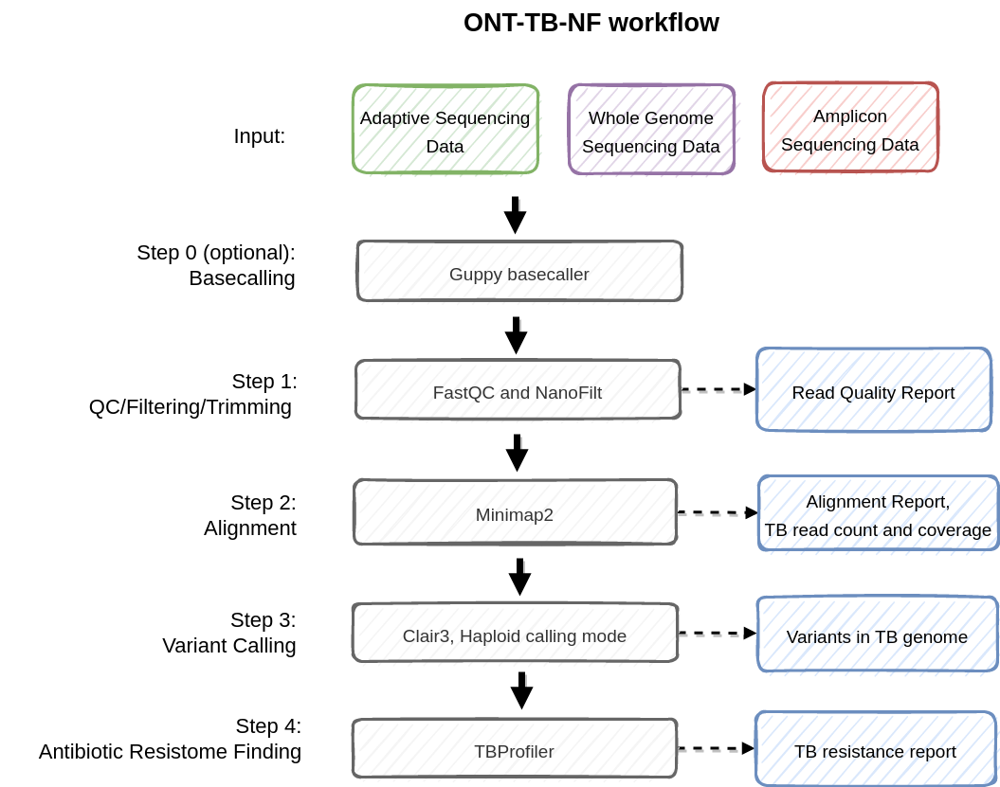

# ONT-TB-NF

[](https://opensource.org/licenses/BSD-3-Clause) 
[](https://www.nextflow.io/index.html)
[](https://github.com/HKU-BAL/Clair3)
[](https://nanoporetech.com/)
[](https://nanoporetech.com/about-us/news/towards-real-time-targeting-enrichment-or-other-sampling-nanopore-sequencing-devices)


The ONT-TB-NF pipeline is built to detect *[Mycobacterium tuberculosis](https://en.wikipedia.org/wiki/Mycobacterium_tuberculosis)* (TB) antibiotic-resistance genes from ONT sequencing data. 

The input sequencing data can be obtained from various settings of [ONT sequencing](https://nanoporetech.com/products), including
- Adaptive sequencing (like from [readfish](https://github.com/looselab/readfish) or [UNCALLED](https://github.com/skovaka/UNCALLED)), 
- Amplicon sequencing (by amplifying specific regions in the TB genome),
- Standard whole genome sequencing (WGS).

The ONT-TB-NF pipeline includes steps of basecalling, quality control, target regions alignment, variant calling, and antimicrobial resistance prediction.


## Features

- One command pipeline from sequencing data to TB analysis report. 
- Tailor-made for Adaptive sequencing data, Amplicon, and WGS data.
- Basecalling with ONT's Guppy, the whole pipeline can start from fast5 files.


## Contents

----
* [Installation](#installation)
* [Usage](#usage)
  + [Adaptive sequencing](#for-adaptive-sequencing)
  + [Amplicon sequencing](#for-amplicon-sequencing)
  + [Basecalling with Guppy](#using-guppy-for-basecalling)
* [Pipeline Summary](#pipeline-summary)
* [Pipeline Ouputs](#pipeline-results)
* [Requirements](#requirements)

----


## Installation 

Install [Nextflow](https://www.nextflow.io/) by using the following command: 

    curl -s https://get.nextflow.io | bash 
    
Install required packages with [conda](https://conda.io/projects/conda/en/latest/index.html) and [docker](https://www.docker.com/):

    docker pull hkubal/clair3:v0.1-r12
    docker pull quay.io/biocontainers/tb-profiler:4.3.0--pypyh5e36f6f_0
    
    conda create -n ont_tb samtools=1.15.1 minimap2=2.24 nanoplot=1.40.2 mosdepth=0.3.3 flye=2.9.1 nanofilt fastqc bedtools -c bioconda
    conda activate ont_tb
    # clone ONT-TB-NF
    git clone https://github.com/HKU-BAL/ONT-TB-NF.git
    cd ONT-TB-NF

## Usage 

Launch the pipeline execution with the following command: 

```
conda activate ont_tb

nextflow run_tb.nf --help
nextflow run_tb_amplicon.nf --help
```

### For adaptive sequencing

Make sure you are in the `ont_tb` environment with the command of `conda activate ont_tb`.

```
TB_NF_DIR={ONT-TB-NF PATH}
NF_S=${TB_NF_DIR}/run_tb.nf

SAMPLE_ID={NAME}
FQ={YOUR FQ FILE}
THREADS={THREAD}                  # threads number, e.g. 16
OUT_DIR={ABSOLUTE OUTPUT PATH}    # output path, abolute path required

nextflow run ${NF_S} \
--read_fq ${FQ} \
--sample_name ${SAMPLE_ID} \
--threads ${THREADS} \
--output_dir ${OUT_DIR}
```

### For amplicon sequencing

Make sure you are in the `ont_tb` environment with the command of `conda activate ont_tb`.

For Amplicon sequencing data, the pipeline needs to be provided with the amplicon bed regions from `--amplicon_bed` option.

```
TB_NF_DIR={ONT-TB-NF PATH}
NF_S=${TB_NF_DIR}/run_tb_amplicon.nf

AMPLICON_BED={AMPLICON BED}       # your amplicon region 
FQ={YOUR FQ FILE}
SAMPLE_ID={NAME}
THREADS={THREAD}                  # threads number, e.g. 16
OUT_DIR={ABSOLUTE OUTPUT PATH}    # output path, abolute path required

nextflow run ${NF_S} \
--read_fq ${FQ} \
--sample_name ${SAMPLE_ID} \
--amplicon_bed ${GENE_BED} \
--threads ${THREADS} \
--output_dir ${OUT_DIR}
```

### Using Guppy for basecalling 

```
FAST5_DIR={Input FAST5 folders}
GUPPY_BASECALLER_PATH={Guppy basecaller path}                       # e.g. guppy_basecaller
GUPPY_CONFIG={Guppy config file path}                               # e.g. dna_r10.4_e8.1_sup.cfg

SAMPLE_ID={NAME}
TB_NF_DIR={ONT-TB-NF PATH}
NF_S=${TB_NF_DIR}/run_tb_amplicon.nf                                # e.g. run_tb.nf or run_tb_amplicon.nf
THREADS={THREAD}                                                    # threads number, e.g. 16
OUT_DIR={ABSOLUTE OUTPUT PATH}                                      # output path, abolute path required

nextflow run ${NF_S} --fast5_dir ${FAST5_DIR} --guppy_basecaller_path ${GUPPY_BASECALLER_PATH} --guppy_config_path ${GUPPY_CONFIG} --guppy_options "--device 'cuda:0'" --sample_name ${SAMPLE_ID} --threads ${THREADS} --output_dir ${OUT_DIR}
```


## Pipeline Summary

For apply at WGS and adaptive sequencing, please use the default `run_tb.nf` pipeline. 

For analysis of the Amplicon sequencing data, please use the `run_tb_amplicon.nf` pipeline. 

In general, the ONT-TB-NF pipeline performs the following tasks:

- Basecalling (Guppy, guppy_basecaller)
- Sequencing quality control ([FastQC](https://www.bioinformatics.babraham.ac.uk/projects/fastqc/))
- Filtering and Trimming of read ([NanoFilt](https://github.com/wdecoster/nanofilt))
- Taxonomic classification ([MegaPath-Nano](https://github.com/HKU-BAL/MegaPath-Nano))
- Alignment ([minimap2](https://github.com/lh3/minimap2))
- Variant calling ([Clair3](https://github.com/HKU-BAL/Clair3))
- Antibiotic resistome finding ([TBProfiler](https://github.com/jodyphelan/TBProfiler))




## Pipeline results


Here is a brief description of output files created for each sample, optional module are labeled with [O]:
```
[O] Basecalling results at:       {YOUR OUTPUR DIR}/0_bc
    QC results at:                {YOUR OUTPUR DIR}/1_qc
    Aligment results at:          {YOUR OUTPUR DIR}/2_aln
    Variant calling results at:   {YOUR OUTPUR DIR}/3_vc
    TB analysis report at:        {YOUR OUTPUR DIR}/4_tb
[O] taxonomic classification at:  {YOUR OUTPUR DIR}/5_mpn
```

## Requirements 

* [Nextflow](https://www.nextflow.io) 22.04.5 (or later)
* [Java 17](https://www.oracle.com/java/technologies/downloads/)
* [Docker](https://www.docker.com/) 20.10.7 

